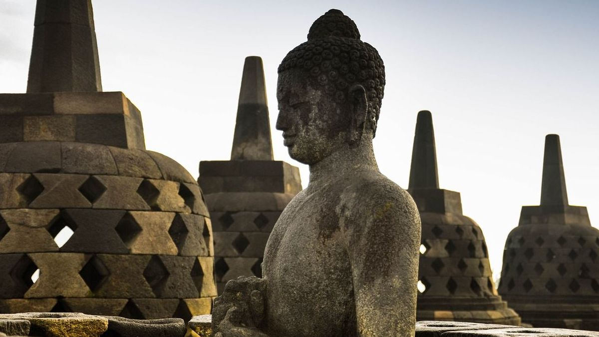

My 2 week trip to Indonesia was a repository of joy, excitement and adventure. Flight missed, bad weather, bus delayed, all of the unpleasant experiences had been well compensated by the beauty of the country. One of the highlights was definitely the unexpected allure of Yogyakarta, where you can find the most ancient and pure charisma of the land of islands.

Yogyakarta, or as the locals call Jogja, is located in the central area of Java island. It is renowned for its education, classical Javanese fine art and culture such as batik, ballet, drama, music, poetry and puppet shows. With its Muslim majority, Jogja demonstrates itself as a traditional, reserved, yet mysteriously beautiful city. We did not have high expectations for the city since our main focus was visiting the magnificent Borobudur, 40km away from Jogja. However, the city, like a lovely old lady, greeted us with warm hug. We experienced some of the superlatives in our trip within merely 2 days in Jogja: the best food, the cheapest city, the least tourists, the most hospitable locals, all of which made Jogja a heaven for us to have some peaceful rest after a chaotic start and explore different sides of the Javanese lives. 

Jogja, as much as we enjoyed it, was for most people simply an overnight destination, since one of the greatest attractions in Indonesia is only 1 hour’s drive from the city center. Borobudur Temple Compounds is one of the greatest Buddhist monuments in the world, and was built in the 8th and 9th centuries AD. Widely considered to be one of the wonders of the world, the temple sits majestically on a hilltop overlooking lush green fields and distant hills and is one of the world’s most complex buildings. The temple is decorated with stone carvings in bas-relief representing images from the life of Buddha. Visiting Borobudur on a rainy day made me realize the marvel of the temple even more. Standing there, surrounded by statues of Buddha, under a dark cloudy sky made even an atheist like me feel the power and magnificence of Buddhism. The temple’s design in Gupta architecture reflects India's influence on the region, yet there are enough indigenous scenes and elements incorporated to make Borobudur uniquely Indonesian. 